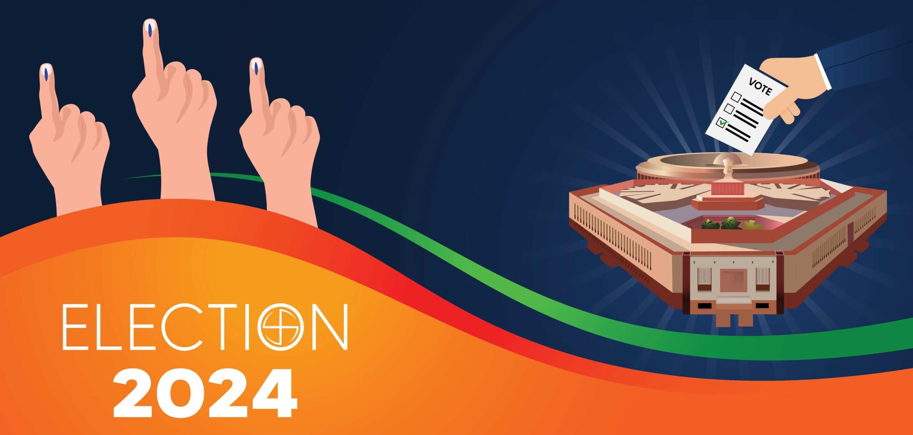
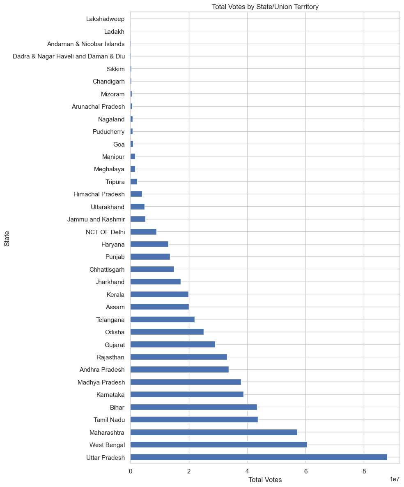
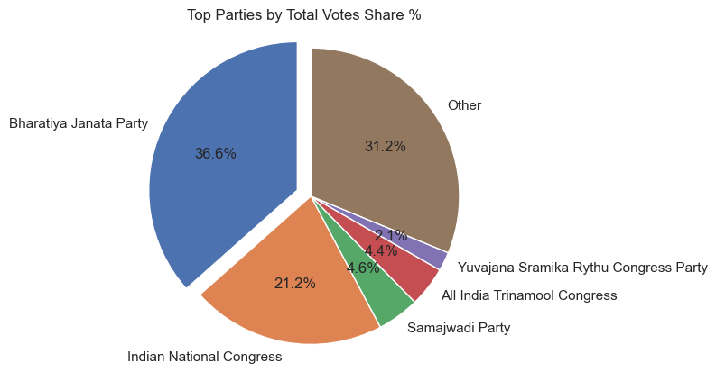
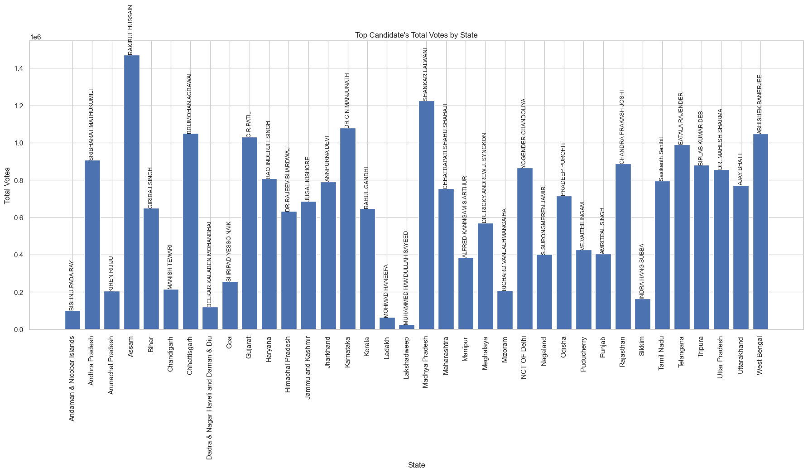
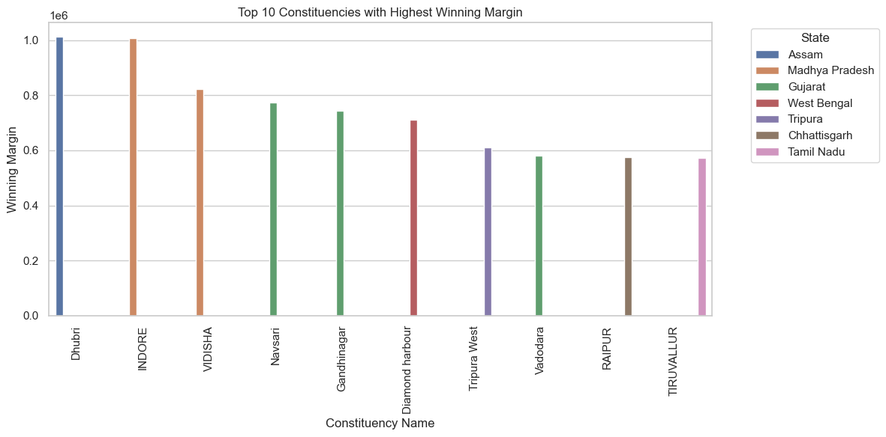
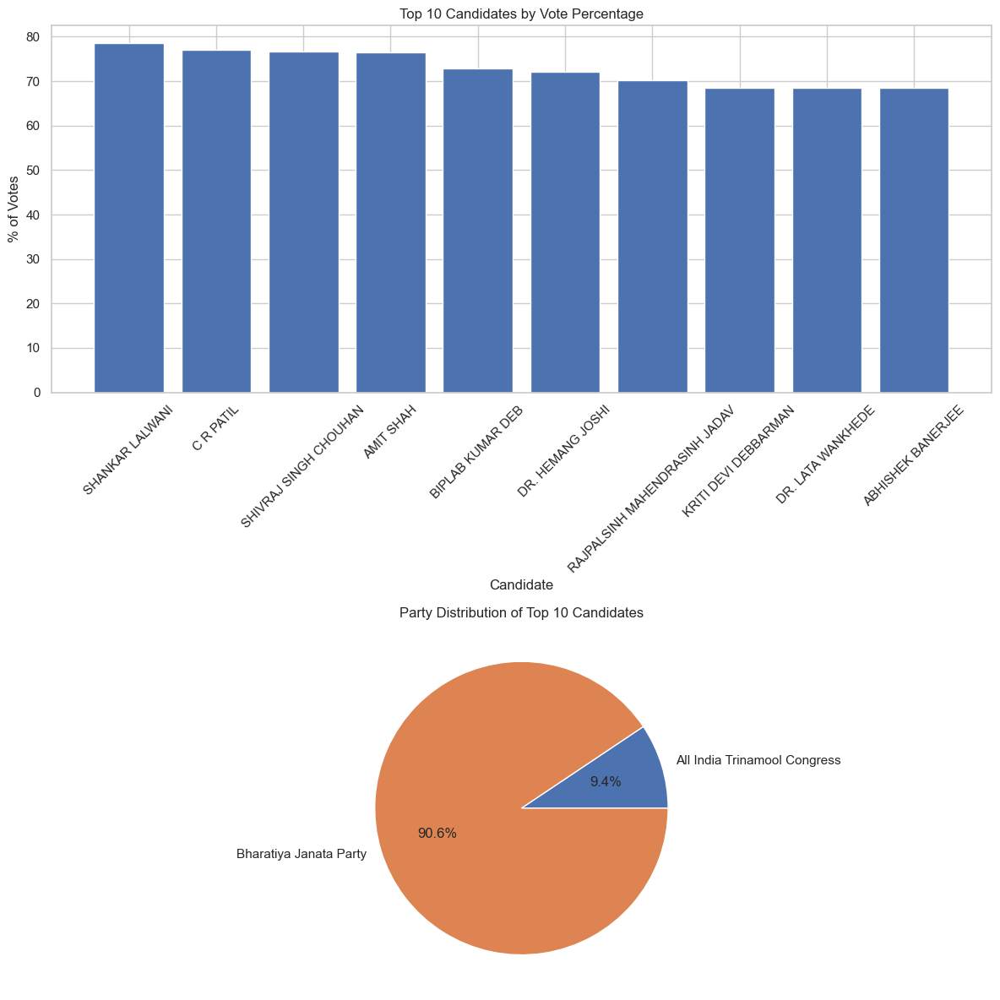
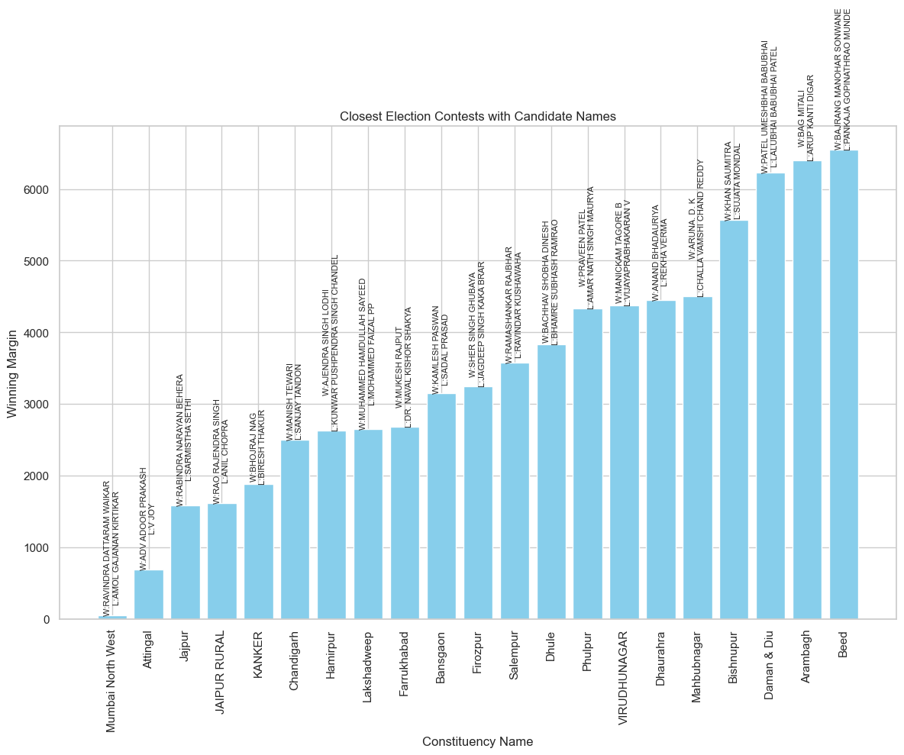
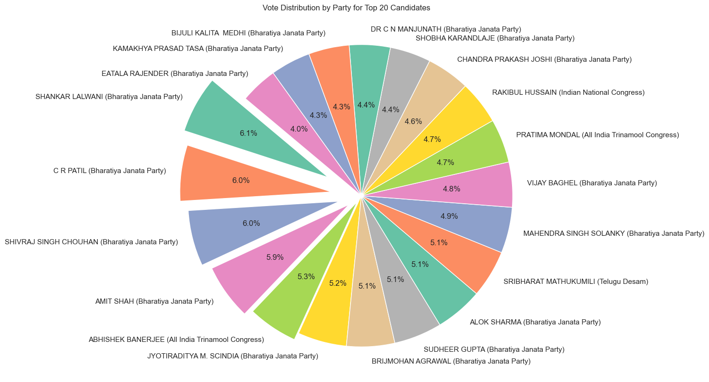
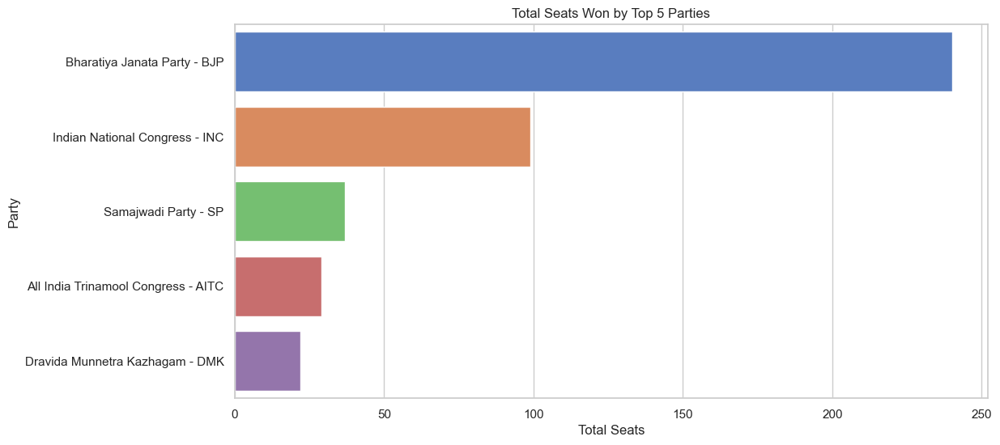

# General_election_Analysis_2024

## Introduction 
Recently we concluded the most awaited festivel of the democracy which is Indian General Election, after the election ECI released the data of each constituency and each candidate which contain information such as Candidate Name, Party, Total Votes, % of Votes and Postal Votes.
Here We are scrapping the data from the ECI website using BeautifulSoup, this repo contain :
1. scraper.py : This send the request to ECI website and from there it scrape data of all candidate based on there state and constituency.
2. data : This folder contain all data in structured way which can be further used for analysis of each state and constituency and make their seperate reports.
3. process.ipynb : After scraping there are few column which we dont require and few columns we need to add this process file is handeling all basic structure fixing of csv files.
4. analysis.ipynb : Here we are doing all the analysis possible and generating a basic report from our analysis.

## Report
1.  Total number of candidates: 8360  
    This contain all candidate as well as NOTA as a Individual candidate from each constituency.

    Total number of candidates including NOTA: 8902  
    This contain all candidate as well as NOTA as a single candidate from overall country.

2.  Total number of parties: 4664  
    This count includes Independent candidates as a party

    Total number of registered parties: 744  
    This count excludes Independent candidates

3.  Total Votes by State/Union Territory
    
    we can clearly see State with most numbers of constituency gained most no. of votes.
    Top state by vote share is 
        1. UP               87911642                                  
        2. West Bengal      60483687  
        3. Maharashtra      57179133  
        4. Tamil Nadu       43674048  
        5. Bihar            43448949  

4.  Top Parties by Voting Percentage
    
    We can see that top parties are:
    BJP  
    INC  
    SP  
    AITC  
    YSRCP  

5.  Here is the top candidate by vote share from each state.
    

6.  Top 10 Constituencies/Candidates with Highest Winning Margins:  
            Constituency Name                 Winner       
        156            Dhubri        RAKIBUL HUSSAIN    
        220            INDORE        SHANKAR LALWANI     
        523           VIDISHA  SHIVRAJ SINGH CHOUHAN    
        382           Navsari              C R PATIL    
        185       Gandhinagar              AMIT SHAH   
        158   Diamond harbour      ABHISHEK BANERJEE   
        511      Tripura West       BIPLAB KUMAR DEB   
        527          Vadodara       DR. HEMANG JOSHI    
        420            RAIPUR      BRIJMOHAN AGRAWAL    
        501        TIRUVALLUR      Sasikanth Senthil    
    
    

7.  Top candidates by voting percentage and parties distribution of top 10 candidate
    

8.  Closet/Minimum Win Margin by candidate and constituency
    

9.  Top 20 candidate and percentage of vote among them
    

10.  Party with maximum no. of seat
    